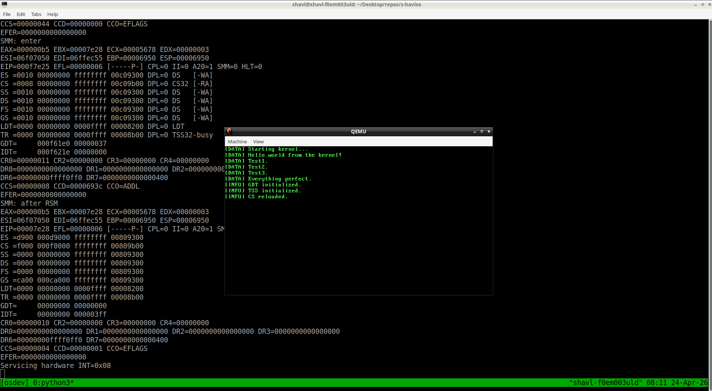

# STRIX

STRIX is an experimental operating system written in C and x86_64 assembly.

The goal of the project is to explore low-level system development by implementing a custom boot process, kernel architecture, drivers, and system libraries from scratch.

This repository contains the early development of the system including the bootloader, kernel core, basic drivers, filesystem foundations, and supporting libraries.

---



# Current Status

The project is in an early stage of development.

At the moment the kernel boots successfully and executes code in the kernel entry point.

Example kernel output:

```
[DATA] Starting kernel...
[DATA] Hello world from the kernel!
[DATA] Test1.
[DATA] Test2.
[DATA] Test3.
[DATA] Everything perfect.
[INFO] GDT initialized.
[INFO] TSS initialized.
[INFO] CS reloaded.
Entering long mode...
ELF successfully detected. Entry point: 0x
0010006C
```

---

# System Architecture

The system currently consists of several core layers.

```
Disk Image
    │
    ▼
Stage 1 Bootloader
    │
    ▼
Stage 2 Bootloader
    │
    ▼
Kernel Entry (_start)
    │
    ▼
Kernel Libraries
    │
    ▼
Kernel Output (VGA)
```

The bootloader loads the kernel and transfers control to the kernel entry point `_start`.

---

# Boot Flow

```
+----------------------+
|        BIOS          |
+----------+-----------+
           │
           ▼
+----------------------+
|     stage1.asm       |
|   (bootloader)       |
+----------+-----------+
           │
           ▼
+----------------------+
|     stage2.asm       |
| secondary loader     |
+----------+-----------+
           │
           ▼
+----------------------+
|       Kernel         |
|      _start()        |
+----------+-----------+
           │
           ▼
+----------------------+
|     Kernel Output    |
|      (kprintf)       |
+----------------------+
```

---

# Features (Current)

Implemented components in the repository:

Boot system

* Two-stage bootloader written in x86_64 assembly

Kernel

* Kernel entry point
* Basic screen output through `kprintf`
* Kernel utility library (`libk`)

Libraries

* Minimal kernel printing library
* Early libc structure

Drivers

* keyboard driver
* ATA storage driver
* VGA video driver

Filesystem layer

* Virtual filesystem interface
* FAT filesystem implementation (early stage)

Userland foundation

* initial directory structure for user programs

Build tools

* disk image builder
* filesystem builder
* ISO generation scripts

---

# Kernel Example

Current kernel entry point:

```
void _start(void) {
    clear_screen();

    kprintf("Starting kernel...")
    kprintf("Hello world from the kernel!\n");
    kprintf("Test1.\n");
    kprintf("Test2.\n");
    kprintf("Test3.\n");
    kprintf("Everything perfect.\n");

    while (1) {
        __asm__("hlt");
    }
}
```

The kernel clears the screen and prints diagnostic messages using `kprintf`.

---

# Project Structure

```
arch/        architecture specific code (x86_64)
drivers/     hardware drivers
fs/          filesystem layer
gui/         graphical subsystem (early structure)
include/     shared kernel headers
kernel/      kernel entry and core code
libc/        minimal C standard library
libk/        kernel utility library
tools/       build tools and disk utilities
userland/    user programs
docs/        design notes and documentation
```

Architecture specific code is located in:

```
arch/x86_64
```

This directory contains the bootloader and architecture-dependent components.

---

# Build

Build the system:

```
make
```

Run the operating system:

```
make run
```

Clean build files:

```
make clean
```

Debug the kernel using GDB:

```
make gdb
```

---

# Tools

The project includes helper scripts for building disk images and filesystems.

```
tools/
    fs-builder.py
    image-builder.sh
    iso-creator.sh
```

These scripts automate the process of creating bootable images.

---

# Documentation

Additional notes and technical documentation are available in:

```
docs/
```

---

# Purpose

STRIX is primarily a learning project intended to explore:

* operating system architecture
* bootloader development
* kernel programming
* hardware interaction
* filesystem design

---

# License

GNU General Public License v3.0

